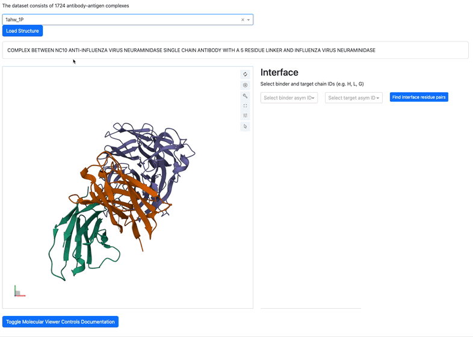

# AsEP Dataset

<!-- https://img.shields.io/badges/static-badge -->
[](https://doi.org/10.5281/zenodo.11495514)
[](https://opensource.org/licenses/MIT)
[](https://www.python.org/)

[](https://pytorch.org/)

**A**ntibody-**s**pecific **E**pitope **P**rediction (AsEP) Dataset. This dataset is used in the manuscript [*AsEP: Benchmarking Deep Learning Methods for Antibody-specific Epitope Prediction*](https://arxiv.org/abs/2407.18184v1) (submitted to NeurIPS 2024 Datasets and Benchmarks).

The raw dataset can be downloaded from [Zenodo](https://doi.org/10.5281/zenodo.11495514).

<!-- table of contents -->
- [AsEP Dataset](#asep-dataset)
  - [Structure viewer](#structure-viewer)
  - [Dataset Python Interface (`asep`)](#dataset-python-interface-asep)
    - [Installation](#installation)
      - [devcontainer](#devcontainer)
      - [conda environment](#conda-environment)
    - [Download dataset](#download-dataset)
    - [Data Loader](#data-loader)
    - [Data Split](#data-split)
    - [Evaluation](#evaluation)
  - [Benchmark Performance](#benchmark-performance)
    - [Epitope Ratio](#epitope-ratio)
    - [Epitope Group](#epitope-group)

---

## Structure viewer

We provide a 3D viewer for antibody-antigen interface visualization.
Check it out at [AsEP](https://walle.abycloud.net)

[](https://walle.abycloud.net)


## Dataset Python Interface (`asep`)

To use the python interface, please install the package `asep`. It provides the following functionalities:

- Dataset interface (see below)
- Code for loading pre-constructed graphs for antibody-antigen complexes in the dataset
- Code for constructing the neural network proposed in our manuscript - use Protein Language Models (PLMs) for node embeddings and Graph Neural Networks (GNNs) for graph representation
- Training and evaluation scripts

### Installation

#### devcontainer

We provide devcontainer configuration for Visual Studio Code in `.devcontainer` directory.
We recommend users to use the devcontainer for development.
The documentation for using devcontainer in Visual Studio Code [here](https://code.visualstudio.com/docs/remote/containers).

#### conda environment

```shell
# enable conda (init zsh if you are using zsh, or init bash etc.)
conda init zsh

# you can also use `make` to prepare the conda environment
make setup-gpu-env

# if you don't have a GPU, then run
# make setup-cpu-env

# install other dependencies
make install-dependencies
```

This requires `make`, run `sudo apt install make` to install.

This will do the following:

- create a conda environment named `walle`
- install the required packages
- install the `asep` package in editable mode.

### Download dataset

Apart from the [Zenodo link](https://doi.org/10.5281/zenodo.11495514), we also provide console scripts to download the dataset. You can download the dataset by running the following command:

```shell
download-asep /path/to/directory AsEP
```

- `/path/to/directory` is the directory where you want to save the dataset.
- `AsEP` is the name of the dataset, by default, it is `AsEP`.

### Data Loader

The antibody-antigen complexes are provided as 2D graph pairs. We provide two types of node features, one-hot encoding and pre-calculated embeddings with AntiBERTy and ESM2.

```python
from asep.data.asepv1_dataset import AsEPv1Dataset, EmbeddingConfig

# one-hot encoding
config = EmbeddingConfig(node_feat_type="one-hot")
asepv1_dataset = AsEPv1Dataset(
        root="/path/to/asep/folder",
        name="AsEP",
        embedding_config=config,
)

# pre-calculated embeddings with AntiBERTy (via igfold) and ESM2
config = EmbeddingConfig(
    node_feat_type='pre_cal',
    ab={"embedding_model": "igfold"},  # change this "esm2" for ESM2 embeddings
    ag={"embedding_model": "esm2"},
)
asepv1_dataset = AsEPv1Dataset(
        root="/path/to/asep/folder",
        name="AsEP",
        embedding_config=config,
)

# get i-th graph pair and node labels
i = 0
graph_pair = asepv1_dataset[i]
node_labels_b = graph_pair.y_b  # antibody graph node labels (1 => interface nodes)
node_labels_g = graph_pair.y_g  # antigen  graph node labels (1 => interface nodes)

# bipartite graph edges
edge_index_bg = graph_pair.edge_index_bg  # bipartite graph edge indices between the antibody and antigen graphs of shape (2, E), 1st col is antibody node indices, 2nd col is antigen node indices
```

The graph pair object `graph_pair` is a `PairData` (inherited from `torch_geometric.data.Data`) object, which contains the following attributes:

- `x_b`, `x_g`: node features of the antibody and antigen, respectively.
  - if `one-hot`, then `x_b` and `x_g` are one-hot encoding of the amino acid residues, shape of `(N, 20)`
  - if `pre_cal`, then `x_b` and `x_g` are embedded with AntiBERTy and ESM2 `esm2_t12_35M_UR50D`, shape of `(N, 512)` and `(N, 480)` respectively
- `edge_index_b`, `edge_index_g` are edge indices of the antibody and antigen graphs, respectively `(2, E)`
- `edge_index_bg`: bipartite graph edge indices between the antibody and antigen graphs `(2, E)`
- `y_b` and `y_g` are node labels for antibody and antigen graphs, respectively `(N,)`
  - `1` indicates interface residues
  - `0` indicates non-interface residues

### Data Split

```python
# split_method either "epitope_ratio" or "epitope_group"
split_idx = asepv1_dataset.get_idx_split(split_method="epitope_ratio")
train_set = asepv1_dataset[split_idx['train']]
valid_set = asepv1_dataset[split_idx['valid']]
test_set  = asepv1_dataset[split_idx['test']]

print(f"{len(asepv1_dataset)=}")  # number of graph pairs
print(f"{len(train_set)=}")       # number of training graph pairs
print(f"{len(valid_set)=}")       # validation
print(f"{len(test_set)=}")        # testing

# len(asepv1_dataset)=1723
# len(train_set)=1383
# len(valid_set)=170
# len(test_set)=170
```

### Evaluation

We provide an evaluator to evaluate model's performance on the AsEPv1 dataset.

- `y_pred`: `torch.Tensor` predicted node labels, shape of `(N,)`
- `y_true`: `torch.Tensor` ground truth node labels, shape of `(N,)`

```python
from asep.data.asepv1_dataset import AsEPv1Evaluator

evaluator = AsEPv1Evaluator()

# example
torch.manual_seed(0)
y_pred = torch.rand(1000)
y_true = torch.randint(0, 2, (1000,))

input_dict = {'y_pred': y_pred, 'y_true': y_true}
result_dict = evaluator.eval(input_dict)
print(result_dict)  # got {'auc-prc': tensor(0.5565)}
```

## Benchmark Performance

Benchmark performance of several deep learning models on the AsEP dataset on two settings: `epitope ratio` and `epitope group`.

| Methods        | Publication                                                  | Code/Repository                                                                              | Antibody-specific | Structure | PLM | Graph |
| -------------- | ------------------------------------------------------------ | -------------------------------------------------------------------------------------------- | ----------------- | --------- | --- | ----- |
| **WALLE**      | Under review                                                 | Here                                                                                         | ✅                 | ✅         | ✅   | ✅     |
| **EpiPred**    | [Publication](https://doi.org/10.1093/bioinformatics/btu190) | [Code](https://opig.stats.ox.ac.uk/webapps/sabdab-sabpred/sabpred/more#EpiPred)              | ✅                 | ✅         | ✕   | ✅     |
| **ESMFold**    | [Publication](https://doi.org/10.1126/science.ade2574)       | [GitHub](https://github.com/facebookresearch/esm)                                            | ✅                 | ✕         | ✅   | ✕     |
| **MaSIF-site** | [Publication](https://doi.org/10.1038/s41592-019-0666-6)     | [GitHub](https://github.com/LPDI-EPFL/masif)                                                 | ✕                 | ✅         | ✕   | ✅     |
| **ESMBind**    | [Publication](https://doi.org/10.1101/2023.11.13.566930)     | [HuggingFace](https://huggingface.co/AmelieSchreiber/esm2_t12_35M_lora_binding_sites_v2_cp3) | ✕                 | ✕         | ✅   | ✕     |


### Epitope Ratio

| Algorithm  | MCC               | Precision         | Recall            | AUCROC            | F1                |
| ---------- | ----------------- | ----------------- | ----------------- | ----------------- | ----------------- |
| WALLE      | **0.210** (0.020) | **0.235** (0.018) | **0.422** (0.028) | **0.635** (0.013) | **0.258** (0.018) |
| EpiPred    | 0.029 (0.018)     | 0.122 (0.014)     | 0.180 (0.019)     | —                 | 0.142 (0.016)     |
| ESMFold    | 0.028 (0.010)     | 0.137 (0.019)     | 0.043 (0.006)     | 0.060 (0.008)     | —                 |
| ESMBind    | 0.016 (0.008)     | 0.106 (0.012)     | 0.121 (0.014)     | 0.506 (0.004)     | 0.090 (0.009)     |
| MaSIF-site | 0.037 (0.012)     | 0.125 (0.015)     | 0.183 (0.017)     | —                 | 0.114 (0.011)     |

Values in parentheses are standard errors.

### Epitope Group

| Algorithm  | MCC               | Precision         | Recall            | AUCROC            | F1                |
| ---------- | ----------------- | ----------------- | ----------------- | ----------------- | ----------------- |
| WALLE      | **0.077** (0.015) | 0.143 (0.017)     | **0.266** (0.025) | **0.544** (0.010) | **0.145** (0.014) |
| EpiPred    | -0.006 (0.015)    | 0.089 (0.011)     | 0.158 (0.019)     | —                 | 0.112 (0.014)     |
| ESMFold    | 0.018 (0.010)     | 0.113 (0.019)     | 0.034 (0.007)     | —                 | 0.046 (0.009)     |
| ESMBind    | 0.002 (0.008)     | 0.082 (0.011)     | 0.076 (0.011)     | 0.500 (0.004)     | 0.064 (0.008)     |
| MaSIF-site | 0.046 (0.014)     | **0.164** (0.020) | 0.174 (0.015)     | —                 | 0.128 (0.012)     |

Values in parentheses are standard errors.
